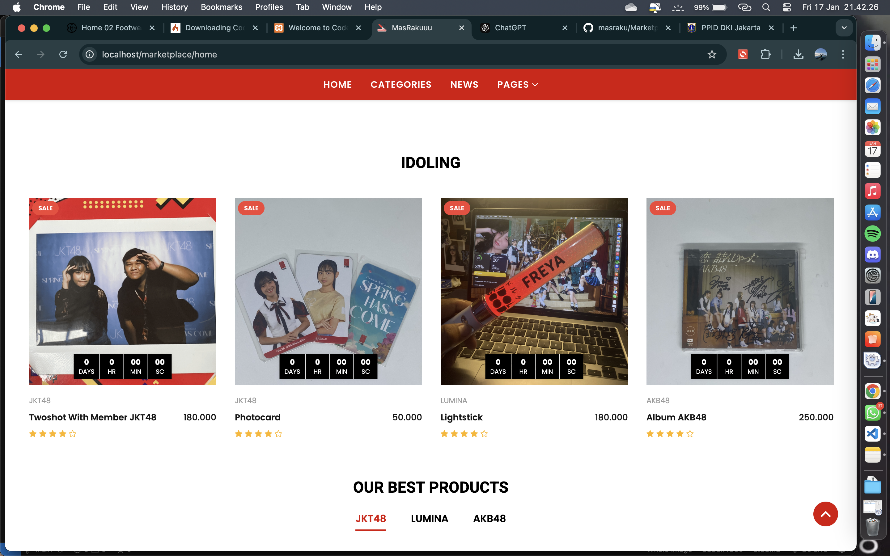

##Web Marketplace dengan tema JKT48

Web Marketplace ini berbasis CodeIgniter 3 (CI3) yaitu aplikasi berbasis web yang dibangun menggunakan framework PHP CodeIgniter versi 3. Framework ini mengadopsi konsep Model-View-Controller (MVC) yang memisahkan logika bisnis (Model), tampilan antarmuka pengguna (View), dan pengelolaan alur aplikasi (Controller).

*******************
Release Information
*******************

This repo contains in-development code for future releases. To download the
latest stable release please visit the `CodeIgniter Downloads
<https://codeigniter.com/download>`_ page.

**************************
Changelog and New Features
**************************

You can find a list of all changes for each release in the `user
guide change log <https://github.com/bcit-ci/CodeIgniter/blob/develop/user_guide_src/source/changelog.rst>`_.

*******************
Server Requirements
*******************

PHP version 5.6 or newer is recommended.

bekerja pada 5.3.7 juga, tapi kami sangat menyarankan Anda untuk TIDAK menjalankannya
versi PHP yang lama, karena potensi keamanan dan kinerjanya
masalah, serta fitur yang hilang.

************
Installation
************

Sebelum memulai pengembangan proyek web Marketplace menggunakan CodeIgniter 3, Anda perlu melakukan instalasi dan konfigurasi awal untuk memastikan aplikasi berjalan dengan baik. Berikut adalah langkah-langkah instalasi yang harus dilakukan:
persiapan awal : 
1. download atau clone folder
2. copy file 
3. paste file di directory xampp/htdocs

Langkah 1: Persiapan Database

-Masuk ke phpMyAdmin
	Buka browser dan akses phpMyAdmin melalui URL, biasanya http://localhost/phpmyadmin.
-Buat Database Baru
	Klik tab Databases, masukkan nama database (misalnya DBMarketplace), lalu klik Create.
-Import File Database
	Pilih database DBMarketplace yang telah dibuat.
Klik tab Import, lalu unggah file DBMarketplace.sql yang disediakan.
Klik Go untuk menjalankan proses impor data.

Langkah 2: Konfigurasi CodeIgniter

-Konfigurasi base_url
	Buka file konfigurasi utama di application/config/config.php.
	Temukan baris:
	$config['base_url'] = '';
	Ubah nilainya sesuai dengan nama file atau URL proyek, misalnya:
	$config['base_url'] = 'http://localhost/Marketplace/';

-Konfigurasi Database
	Buka file application/config/database.php.
	Atur parameter koneksi database sesuai dengan konfigurasi server Anda:
	$db['default'] = array(
	    'dsn'   => '',
	    'hostname' => 'localhost',
	    'username' => 'root',
	    'password' => '', // Jika ada password, tambahkan di sini
	    'database' => 'DBMarketplace',
	    'dbdriver' => 'mysqli',
	    'dbprefix' => '',
	    'pconnect' => FALSE,
	    'db_debug' => (ENVIRONMENT !== 'production'),
	    'cache_on' => FALSE,
	    'cachedir' => '',
	    'char_set' => 'utf8',
	    'dbcollat' => 'utf8_general_ci',
	    'swap_pre' => '',
	    'encrypt' => FALSE,
	    'compress' => FALSE,
	    'stricton' => FALSE,
	    'failover' => array(),
	    'save_queries' => TRUE
	);

*******
License
*******

Please see the `license
agreement <https://github.com/bcit-ci/CodeIgniter/blob/develop/user_guide_src/source/license.rst>`_.

*********
Resources
*********

-  `User Guide <https://codeigniter.com/docs>`_
-  `Contributing Guide <https://github.com/bcit-ci/CodeIgniter/blob/develop/contributing.md>`_
-  `Language File Translations <https://github.com/bcit-ci/codeigniter3-translations>`_
-  `Community Forums <http://forum.codeigniter.com/>`_
-  `Community Wiki <https://github.com/bcit-ci/CodeIgniter/wiki>`_
-  `Community Slack Channel <https://codeigniterchat.slack.com>`_

Report security issues to our `Security Panel <mailto:security@codeigniter.com>`_
or via our `page on HackerOne <https://hackerone.com/codeigniter>`_, thank you.

***************
Acknowledgement
***************

The CodeIgniter team would like to thank EllisLab, all the
contributors to the CodeIgniter project and you, the CodeIgniter user.
